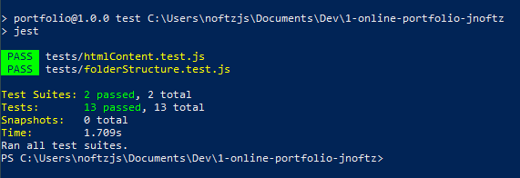

Portfolio Assignment
==========================================

Instructions to this assignment can be found [here](https://it3049c.github.io/Material/Assignments/1.Online_Portfolio/).
## Checklist:
- [X] update the assignment checks above to the correct link
- [X] make sure the assignment checks pass
- [X] fill out the self evaluation and Reflection
- [X] submit the repository and the hosted github pages to Canvas

## Self-Reflection:

I felt that this assignment was a good refreshers of my github skills. Overall I think I did a 8/10 on this assignment, I didn't commit often enough throughout the coding process. 

### How long it took me to finish this?

It took me around ~3 hours to complete.

-----------------------
